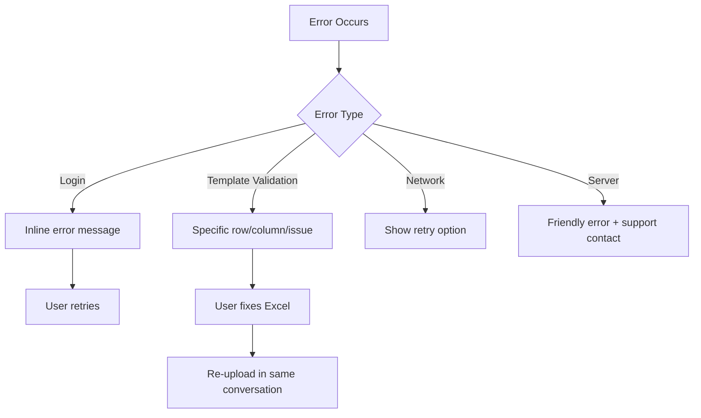

---
stepsCompleted:
  - 1
  - 2
  - 3
  - 4
  - 5
  - 6
  - 7
  - 8
  - 9
  - 10
  - 11
  - 12
  - 13
  - 14
lastStep: 14
workflowComplete: true
completedAt: 2026-01-21
revisedAt: 2026-02-02
revisionNotes: "Major revision aligned with PRD 2026-02-02: Two-agent architecture (Filter + Main) with Python computation; OpenAI as sole LLM provider; removed model selector and agent selection modal; simplified workflow (Nueva conversación → Chat directly); Supabase Auth with password recovery; desktop-first with responsive mobile viewing; updated all flows and components. Added Privacy UX Components section (FR-PRIV1, FR-PRIV2): PrivacyTooltip for file upload zone, Footer component with Privacy link, Privacy page layout design, FirstUploadPrivacyNotice for first-time uploaders"
inputDocuments:
  - prd.md
---

# UX Design Specification — Setec AI Hub

**Author:** Setec
**Date:** 2026-01-21
**Revised:** 2026-02-02 (Privacy UX Components added)

---

## Executive Summary

### Project Vision

Setec AI Hub is an AI-powered statistical analysis platform for Lean Six Sigma practitioners. Built for professionals enrolled in Setec's Green Belt training, the platform enables users to perform Measurement System Analysis (MSA) without Minitab or advanced Excel skills — upload your data, chat with an AI agent, and get calculated results with clear methodological explanations.

**How It Works:**

- User messages pass through a **Filter Agent** that ensures queries are topic-relevant
- Valid queries reach the **Main Agent**, which can converse about statistics or invoke a Python-based analysis tool when the user uploads data
- The **Python tool** performs calculations, generates chart data, and returns structured instructions for presenting results — ensuring accuracy and consistency
- The **frontend** renders interactive charts from the structured data

**Platform Architecture:**

- **Setec AI Hub** — End-user platform with ChatGPT-style conversational interface
- **Setec AI Hub Admin** — Separate admin portal for user management (Post-MVP)
- **Language:** Entire platform in Spanish
- **LLM Provider:** OpenAI (selected for cost efficiency and mature function-calling API)

### Target Users

**End Users (María, Carlos, David)**

- Professionals at companies enrolled in Setec's LSS training
- Learning statistical methodology but approaching analysis as regular work tasks
- Need clear, contextualized results they can confidently present to stakeholders
- Desktop workers (data preparation, uploads, analysis review) with mobile viewing capability
- Use the platform during training weeks AND as an ongoing daily work tool

**Admins (Sofía)** — Post-MVP

- Setec training coordinators managing user access for training cohorts
- Need fast, simple user provisioning (create 25 accounts for Monday's cohort)
- No access to user analysis data — only user management

### Key Design Challenges

1. **The Template Workflow** — Users must download Excel templates, fill them externally, then return to upload. The UX must make this feel like a seamless workflow rather than a fragmented chore, especially for repeat users who do this daily.

2. **Error Recovery with Dignity** — When validation fails (wrong data types, missing fields), error messages must be specific, actionable, and respectful. Point to exact row/column/problem in Spanish without making users feel incompetent.

3. **Chat + Navigation Hybrid** — The Plantillas (templates) section lives outside the chat, yet the agent directs users there. Navigation between conversation and templates must feel natural and not disruptive to the workflow.

4. **Efficiency for Daily Use** — This is a work tool, not a training sandbox. Repeat users should complete analyses quickly without re-reading instructions or navigating unnecessary onboarding flows.

5. **Responsive Design** — Desktop-first experience with functional mobile viewing for checking results on the go.

### Design Opportunities

1. **Contextual Intelligence** — AI interpretations that connect to the user's specific situation. Not "your Gauge R&R is 18.2%" but "your Gauge R&R is 18.2% — for your production line, this means the measurement variation could mask small process improvements."

2. **Professional Confidence** — Every interaction reinforces that this tool produces trustworthy, defensible results. Users should feel confident presenting findings to stakeholders knowing the math is deterministic (Python calculations) and the interpretation is sound.

3. **Spanish-First Design** — Not a translation layer over an English app. Designed in Spanish from the ground up, with natural phrasing and warmth appropriate to the language and culture.

4. **Scalable Analysis Architecture** — MVP launches with MSA. Post-MVP adds Control Charts, Fishbone/5 Whys, and Hypothesis Testing. The interface should feel complete and intentional at each phase, with clear paths for the ~15 analysis types planned in future phases.

## Core User Experience

### Defining Experience

The core experience of Setec AI Hub is the **analysis cycle**: upload data, receive interpreted results. This is what users come for, what they repeat daily, and what determines whether the platform succeeds.

**The Core Loop:**

1. User starts a new conversation (one click)
2. Agent greets user and presents capabilities (MSA, control charts, hypothesis testing, etc.)
3. User indicates what analysis they need
4. Agent guides user to download the appropriate template from Plantillas
5. User fills template with their data externally
6. User returns to chat and uploads the filled template
7. Python tool validates data, computes results, and returns structured output
8. Agent presents results with contextualized explanation
9. Frontend renders interactive charts from structured data
10. User asks follow-up questions if needed

The entire platform exists to make this loop fast, reliable, and insightful. Every design decision should be evaluated against: "Does this make the analysis cycle better?"

### Platform Strategy

| Platform                       | Purpose                                                                                            | Priority           |
| ------------------------------ | -------------------------------------------------------------------------------------------------- | ------------------ |
| **Desktop Web (User Hub)**     | Full analysis workflow — template download, data preparation, upload, results, follow-up questions | Primary            |
| **Mobile Web (User Hub)**      | View results, check conversation history, review charts                                            | Secondary (viewing)|
| **Desktop Web (Admin Portal)** | User management — create, edit, delete user accounts                                               | Primary (Post-MVP) |

**MVP Authentication Model:**

- Single user account via Supabase Auth (email/password)
- Account created manually in Supabase dashboard before launch
- Password recovery via Supabase Auth email flow
- Conversations visible only to the authenticated user

**Desktop-First, Mobile-Responsive Rationale:**

- Users work with Excel templates requiring keyboard/mouse precision (desktop)
- Data preparation happens in desktop workflows
- Statistical results benefit from larger screen real estate for charts and tables
- Mobile viewing allows checking results and history on the go
- No mobile file upload expected (users return to desktop for analysis)

### Effortless Interactions

These interactions must feel completely frictionless — zero cognitive load:

| Interaction                    | Effortless Standard                                                                                                         |
| ------------------------------ | --------------------------------------------------------------------------------------------------------------------------- |
| **Starting a new analysis**    | One click "Nueva conversación" → agent ready to help. No tutorials, no onboarding walls.                                    |
| **Finding the right template** | Agent tells user exactly which template; one click to Plantillas section; template downloads instantly.                     |
| **Understanding results**      | No unexplained jargon. Every statistical term comes with plain-language interpretation relevant to user's context.          |
| **Returning to past work**     | Conversation history visible in sidebar, scannable by date, searchable by keyword.                                          |
| **Error recovery**             | Validation errors point to exact problem (row, column, issue) with clear fix instructions. Re-upload without starting over. |

### Critical Success Moments

**The Make-or-Break Moment: Results Delivery**

The instant after upload — when the user sees their results with interpretation — is the moment that determines trust. This moment must deliver:

- **Accuracy** — Statistical results are correct (guaranteed by Python scripts with verified formulas)
- **Clarity** — Results are presented clearly with visual hierarchy
- **Context** — Interpretation connects to user's specific situation, not generic textbook output
- **Actionability** — User knows what the results mean and what to do next
- **Interactivity** — Charts respond to hover/click for detailed data exploration

If this moment succeeds, users trust the platform and return daily. If it fails, they question whether they should have used Minitab.

**Secondary Success Moments:**

- First successful upload (validation passes, user feels competent)
- Follow-up question answered helpfully (user learns something)
- Returning user finds past analysis instantly (platform feels organized)
- Viewing results on mobile (continuity across devices)

### Experience Principles

These principles guide all UX decisions for Setec AI Hub:

1. **Results Are the Product** — Every interaction serves the analysis cycle. If a feature doesn't improve the path to interpreted results, question its existence.

2. **Efficiency Over Hand-Holding** — This is a daily work tool. Repeat users should complete analyses in minimal clicks. No forced tutorials, no unnecessary confirmations, no "getting started" modals on every visit.

3. **Contextualized Intelligence** — AI interpretations must connect to user context. Generic statistical explanations fail the core promise. The AI should feel like a knowledgeable colleague who understands your situation.

4. **Errors Are Guidance** — When something goes wrong (validation failure, missing data), the system guides users to resolution. Errors are teaching moments, not dead ends.

5. **Professional Confidence** — The interface should feel trustworthy and competent. Users present these results to stakeholders — the platform must reinforce that the analysis is defensible.

## Desired Emotional Response

### Primary Emotional Goals

Setec AI Hub should evoke **functional confidence** — the quiet assurance that comes from a tool that works reliably and makes you better at your job.

| Emotion       | What It Means                                                                   |
| ------------- | ------------------------------------------------------------------------------- |
| **Competent** | "I can do this analysis correctly" — the platform reinforces user capability    |
| **Confident** | "These results are trustworthy" — users can present findings without hesitation |
| **Efficient** | "This saves me time" — no friction, no unnecessary steps                        |

This is not a tool that aims to delight or surprise. It aims to _work_, to make users feel capable, and to fade into the background while they get their job done.

### Emotional Journey Mapping

| Stage                          | Desired Emotion         | Design Implication                                              |
| ------------------------------ | ----------------------- | --------------------------------------------------------------- |
| **First discovery**            | Intrigued, hopeful      | Clean interface that signals competence; no clutter or gimmicks |
| **First successful analysis**  | Relief, confidence      | Clear success feedback; results that make immediate sense       |
| **Daily repeat use**           | Efficient, capable      | Minimal clicks; no re-explaining; muscle memory forms           |
| **When something goes wrong**  | Guided, not frustrated  | Specific error messages; clear path to resolution               |
| **Presenting to stakeholders** | Professional, confident | Results formatted for sharing; methodology explained defensibly |

### Micro-Emotions

These subtle emotional states determine whether users trust and return to the platform:

| We Cultivate                                 | We Prevent                                         |
| -------------------------------------------- | -------------------------------------------------- |
| **Confidence** — "This is right"             | **Doubt** — "Is this calculation correct?"         |
| **Clarity** — "I understand what this means" | **Confusion** — "What do these numbers mean?"      |
| **Competence** — "I know what I'm doing"     | **Incompetence** — "I'm lost"                      |
| **Trust** — "I can rely on this"             | **Skepticism** — "Should I verify this elsewhere?" |

### Design Implications

**To Build Confidence:**

- Show calculation methodology transparently (user can verify if desired)
- Python scripts with explicit formulas for consistent, reproducible results
- Professional visual design that signals reliability

**To Create Clarity:**

- Every statistical result paired with plain-language interpretation
- Visual hierarchy that guides the eye to what matters
- No unexplained jargon — every term either explained or avoided

**To Reinforce Competence:**

- Interface that respects user intelligence (no excessive hand-holding)
- Clear feedback at every step ("Plantilla válida," "Procesando...")
- Error messages that treat users as capable adults who made a small mistake

**To Establish Trust:**

- Consistent behavior — same input always produces same output
- Transparency about what the AI interprets vs. what Python computes
- Results formatted professionally enough to present to stakeholders

### Emotional Design Principles

1. **Confidence Through Transparency** — Users trust what they can understand. Show the methodology, explain the choices, make the "why" visible.

2. **Respect Over Delight** — This is a work tool. Respect users' time and intelligence. Save the animations and celebrations for consumer apps.

3. **Guidance Without Condescension** — When users make mistakes, guide them to resolution without making them feel stupid. Error messages are teaching moments, not scoldings.

4. **Professional Aesthetic** — The visual design should signal competence and reliability. Clean, organized, trustworthy — like a well-run laboratory, not a playground.

## UX Pattern Analysis & Inspiration

### Inspiring Products Analysis

#### ChatGPT / Claude.ai

**What they do well:**

- Conversational interface that feels natural and immediate
- Persistent conversation history in sidebar for easy navigation
- File upload integrated directly into the chat flow
- Clean, distraction-free interface that keeps focus on the conversation
- Streaming responses that show progress

**Relevant for Setec AI Hub:**

- Core interface pattern for conversations
- Sidebar navigation for conversation history
- File upload UX within chat context
- Response streaming during analysis processing

#### Notion

**What they do well:**

- Professional aesthetic that signals competence without being cold
- Clear content hierarchy with excellent typography
- Workspace organization that scales from simple to complex
- Consistent visual language across all features

**Relevant for Setec AI Hub:**

- Visual design direction — clean, professional, trustworthy
- Typography and spacing standards
- Content hierarchy for results presentation

#### Linear

**What they do well:**

- Keyboard-first design that respects power users
- Fast, responsive interface with minimal loading states
- Progressive disclosure — simple by default, powerful when needed
- No unnecessary confirmations or modals

**Relevant for Setec AI Hub:**

- Efficiency patterns for repeat users
- Keyboard shortcuts for common actions
- Minimal friction philosophy

#### Stripe Dashboard

**What they do well:**

- Complex data presented clearly with excellent visual hierarchy
- Trustworthy, professional feel that inspires confidence
- Clear status indicators and feedback
- Technical information made accessible without dumbing down

**Relevant for Setec AI Hub:**

- Results presentation — charts, tables, metrics displayed clearly
- Professional confidence aesthetic
- Technical accuracy presented accessibly

### Transferable UX Patterns

**Navigation Patterns:**
| Pattern | Source | Application in Setec AI Hub |
|---------|--------|----------------------------|
| Persistent sidebar with history | ChatGPT | Conversation list showing date and preview |
| Single-page app with minimal navigation | Linear | User Hub as single coherent workspace |
| Clear section separation | Notion | Distinct areas for Chat and Plantillas |

**Interaction Patterns:**
| Pattern | Source | Application in Setec AI Hub |
|---------|--------|----------------------------|
| File upload in conversation | ChatGPT, Slack | Excel template upload directly in chat |
| Streaming response feedback | ChatGPT/Claude | Show processing progress during analysis |
| Inline error guidance | Stripe | Validation errors appear contextually with fix suggestions |
| One-click actions | Linear | Download template, start new conversation — single click |

**Visual Patterns:**
| Pattern | Source | Application in Setec AI Hub |
|---------|--------|----------------------------|
| Clean typography hierarchy | Notion | Results with clear headings, body, and data sections |
| Data visualization with context | Stripe | Charts with interpretation labels, not just raw data |
| Professional color palette | Linear/Stripe | Muted, trustworthy colors; strategic accent use |
| Generous whitespace | Notion | Breathing room around content, no cramped layouts |

### Anti-Patterns to Avoid

| Anti-Pattern                             | Why It Fails                                | Our Alternative                                   |
| ---------------------------------------- | ------------------------------------------- | ------------------------------------------------- |
| **Onboarding carousels/tutorials**       | Wastes time for repeat users; condescending | Clean interface that's self-explanatory           |
| **Confirmation modals for safe actions** | Creates friction without value              | Confirm only for destructive actions (delete)     |
| **Animated celebrations**                | Inappropriate for professional work tool    | Subtle success feedback (checkmark, color change) |
| **Complex multi-step wizards**           | Breaks flow, feels bureaucratic             | Single-screen workflows where possible            |
| **Jargon-heavy interfaces**              | Alienates learning users                    | Plain language with optional technical details    |
| **Hidden navigation**                    | Users can't find features                   | Visible, predictable navigation structure         |
| **Auto-playing anything**                | Disrespectful of user attention             | User-initiated actions only                       |

### Design Inspiration Strategy

**Adopt Directly:**

- ChatGPT's conversational interface pattern (sidebar + main chat area)
- Notion's typography and whitespace philosophy
- Stripe's approach to presenting complex data clearly
- Linear's minimal-friction interaction philosophy

**Adapt for Our Context:**

- ChatGPT's file handling → optimize for Excel templates specifically
- Stripe's dashboard density → simplify for single-analysis focus
- Linear's keyboard shortcuts → add only for most frequent actions (future)

**Consciously Avoid:**

- Consumer app patterns (gamification, streaks, badges)
- Enterprise software patterns (complex permissions UI, admin-heavy features)
- Tutorial/onboarding patterns (let the interface be self-evident)
- Minitab's complexity (we're the antidote, not the imitation)

**Unique to Setec AI Hub:**

- Template workflow integration (download → fill → upload) as a first-class flow
- AI interpretation as conversational partner, not just output
- Spanish-first design language and tone
- Statistical education woven into results presentation

## Design System Foundation

### Design System Choice

**Selected: shadcn/ui + Tailwind CSS**

A modern, accessible component library built on Radix primitives with full code ownership, combined with Tailwind CSS for utility-first styling.

### Rationale for Selection

| Factor                     | Why shadcn/ui + Tailwind                                                                                    |
| -------------------------- | ----------------------------------------------------------------------------------------------------------- |
| **Chat interface fit**     | The AI chat ecosystem has standardized on this stack — abundant patterns, examples, and community solutions |
| **Professional aesthetic** | Default components feel like Notion/Linear — clean, modern, exactly our emotional goal                      |
| **Full customization**     | You own the code. Every component can be tweaked to match Setec's brand without fighting the framework      |
| **Accessibility built-in** | Radix primitives handle keyboard navigation, screen readers, and focus management correctly                 |
| **Spanish text handling**  | Tailwind makes it easy to adjust spacing and typography for Spanish (typically ~30% longer than English)    |
| **Next.js compatibility**  | Server components, streaming, and all modern React patterns work seamlessly                                 |
| **Team velocity**          | Copy-paste components mean fast iteration with no black-box dependencies                                    |

### Brand Integration

**Setec Brand Colors (from logo):**

| Token              | Value     | Usage                                                 |
| ------------------ | --------- | ----------------------------------------------------- |
| `--setec-orange`   | `#F7931E` | Primary accent, CTAs, active states, brand highlights |
| `--setec-charcoal` | `#3D3D3D` | Primary text, headers, logo text                      |
| `--setec-white`    | `#FFFFFF` | Backgrounds, contrast elements                        |

**Extended Palette (to be defined):**

- Success green — for validation passed, positive results
- Warning amber — for marginal results, attention needed
- Error red — for validation errors, critical issues
- Neutral grays — for secondary text, borders, backgrounds

**Typography Direction:**

- Clean sans-serif to match logo aesthetic
- Strong hierarchy: clear distinction between headings, body, and data
- Generous line-height for Spanish text readability

### Implementation Approach

**Phase 1: Foundation Setup**

1. Initialize Tailwind CSS with custom configuration
2. Set up shadcn/ui with Setec color tokens
3. Define typography scale and spacing system
4. Create base layout components (sidebar, main area, header)

**Phase 2: Core Components**

1. Chat interface components (message list, input, file upload)
2. Results display components (charts, tables, metrics)
3. Navigation components (sidebar, conversation list)
4. Form components (login, password recovery)

**Phase 3: Specialized Components**

1. Template download cards
2. Validation error displays
3. Statistical result visualizations
4. Interactive chart components

### Customization Strategy

**What We Customize:**

- Color tokens → Setec orange and charcoal as primary colors
- Typography → Font family, sizes, and weights to match brand
- Spacing → Adjusted for Spanish text lengths
- Border radius → Consistent with logo's modern feel
- Shadows → Subtle, professional elevation

**What We Keep Default:**

- Accessibility behavior (Radix primitives)
- Animation timing (unless specifically needed)
- Dark mode tokens (future consideration)

**Component Ownership:**

- All shadcn/ui components copied into project (`/components/ui`)
- Modifications tracked in component files directly
- No external runtime dependencies for UI components

### Available Development Tools

The project includes skills that will support implementation:

- **vercel-react-best-practices** — Performance optimization rules for React/Next.js
- **web-design-guidelines** — UI code review for accessibility and best practices compliance

These should be used during development to ensure quality implementation.

## Defining Core Experience

### The Defining Experience

**"Upload your data, understand your results"**

The defining experience of Setec AI Hub is the transformation moment: raw data in, actionable insight out. This is what María tells her colleague: _"You just upload your data, and it tells you what it means — like having a statistics expert explain your results."_

**The One-Sentence Pitch:**

> Upload a filled template, receive interpreted results with methodology explanation — in seconds, not hours.

This single interaction encapsulates the entire value proposition. If we nail this moment perfectly, everything else follows.

### User Mental Model

**How Users Currently Solve This Problem:**

| Current Approach       | Pain Points                                                                                              |
| ---------------------- | -------------------------------------------------------------------------------------------------------- |
| **Minitab**            | Complex interface, steep learning curve, expensive licenses, cryptic output that requires interpretation |
| **Excel with add-ins** | Manual setup, formula errors, no interpretation layer, easy to make mistakes                             |
| **Ask a colleague**    | Availability constraints, inconsistent explanations, doesn't scale                                       |
| **Google/textbook**    | Time-consuming, generic answers not specific to their data                                               |

**What Users Bring to the Task:**

- Familiarity with Excel (they prepare data there)
- Understanding of basic statistical concepts (from training)
- Mental model of "input → output" from other tools
- Expectation that AI can "explain things" (from ChatGPT)

**Where Confusion Happens:**

- Choosing the right statistical test for their situation
- Understanding what the numbers actually mean
- Knowing if results are good, bad, or marginal
- Translating statistical output into business action

### Success Criteria

**The "This Just Works" Moment:**

| Criteria          | What It Means                                                              |
| ----------------- | -------------------------------------------------------------------------- |
| **Speed**         | Results appear within seconds of upload, not minutes                       |
| **Accuracy**      | Statistical calculations are correct (Python scripts with verified formulas)|
| **Clarity**       | Results are immediately understandable without looking up definitions      |
| **Context**       | Interpretation connects to user's specific situation, not generic textbook |
| **Actionability** | User knows what to do next based on results                                |
| **Confidence**    | User can present findings to stakeholders without hesitation               |

**Success Indicators:**

- User uploads data and receives complete results in < 10 seconds
- User understands the interpretation without asking follow-up clarification questions
- User can explain findings to a colleague in their own words
- User returns to perform another analysis (repeat usage)

### Pattern Analysis

**Established Patterns We Adopt:**

| Pattern                  | Source                 | Why It Works                                          |
| ------------------------ | ---------------------- | ----------------------------------------------------- |
| Conversational interface | ChatGPT                | Users already understand "type/upload → get response" |
| File upload in chat      | ChatGPT, Slack         | Natural integration of files into conversation flow   |
| Results with explanation | ChatGPT, Wolfram Alpha | AI explaining its reasoning builds trust              |
| Sidebar navigation       | ChatGPT, Gmail         | Users expect conversation history on the left         |

**Our Unique Twist:**

- **Structured input** — Unlike ChatGPT's free-form queries, we use Excel templates. This guarantees the AI has correct, complete data.
- **Guided computation** — Python scripts with explicit formulas ensure consistent, verifiable results. The LLM doesn't calculate — it interprets.
- **Domain expertise** — The AI doesn't just explain statistics; it explains _Lean Six Sigma_ statistics in the context of _quality improvement_.
- **Interactive visualization** — Frontend renders charts from structured data, allowing hover/click exploration.

**No Novel Patterns Required:**
Users already know how to use ChatGPT-style interfaces. They already know how to fill Excel templates. We're combining familiar patterns in a domain-specific way — no user education needed.

### Experience Mechanics

**Complete MVP Workflow:**

| Step | Action | UX Element |
|------|--------|------------|
| 1 | User opens Setec AI Hub, logs in via Supabase Auth | Login page with email/password |
| 2 | User clicks "Nueva conversación" | Sidebar button → new chat starts immediately |
| 3 | Agent greets user with general capabilities | Chat message |
| 4 | User indicates what analysis they need: "Necesito hacer un MSA" | Chat message |
| 5 | Agent guides: "Ve a la sección de Plantillas y descarga la plantilla de MSA" | Chat message |
| 6 | User navigates to Plantillas section | Main nav |
| 7 | User downloads MSA Excel template | Template card with download button |
| 8 | User fills template with their data (external to app) | — |
| 9 | User returns to chat, uploads filled template | FileUpload component |
| 10 | Python tool validates upload (structure, data types, required fields) | ValidationError or success message |
| 11 | Python tool computes results and returns structured output | — |
| 12 | Agent presents results with methodology explanation | ResultsDisplay |
| 13 | Frontend renders interactive charts from structured data | Charts component |
| 14 | User can ask follow-up questions in the same conversation | ChatInput |

**The Upload → Interpret Flow:**

```
┌─────────────────────────────────────────────────────────────────┐
│  1. INITIATION                                                  │
│  ─────────────                                                  │
│  User is in a conversation with the agent                       │
│  Agent has explained: "Ve a Plantillas y descarga..."           │
│  User has filled their Excel template with data                 │
│                                                                 │
│  → Trigger: User clicks upload button or drags file into chat   │
├─────────────────────────────────────────────────────────────────┤
│  2. VALIDATION (immediate)                                      │
│  ────────────────────────                                       │
│  Python tool checks:                                            │
│  • Correct template type for requested analysis?                │
│  • Required columns present?                                    │
│  • Data types correct (numbers where expected)?                 │
│  • No missing required values?                                  │
│                                                                 │
│  If valid: → Show "Plantilla válida, procesando..."             │
│  If invalid: → Show specific error with fix instructions        │
├─────────────────────────────────────────────────────────────────┤
│  3. PYTHON COMPUTATION                                          │
│  ────────────────────────                                       │
│  Python script receives validated data and:                     │
│  • Performs statistical computations using verified formulas    │
│  • Prepares chartData for frontend rendering                    │
│  • Generates instructions markdown for presentation             │
│                                                                 │
│  Returns structured output:                                     │
│  {                                                              │
│    results: { /* numerical data */ },                           │
│    chartData: [ /* data for interactive charts */ ],            │
│    instructions: "markdown presentation guide"                  │
│  }                                                              │
├─────────────────────────────────────────────────────────────────┤
│  4. AI INTERPRETATION                                           │
│  ────────────────────────                                       │
│  Agent receives Python output and:                              │
│  • Follows/adapts instructions to conversation context          │
│  • Presents results with plain-language interpretation          │
│  • Explains methodology ("Usé esta prueba porque...")           │
│  • Provides actionable recommendations                          │
│                                                                 │
│  → Stream response as it generates (ChatGPT-style)              │
├─────────────────────────────────────────────────────────────────┤
│  5. VISUALIZATION                                               │
│  ─────────────────                                              │
│  Frontend renders interactive charts from chartData:            │
│  • Hover tooltips for data points                               │
│  • Click interactions for detail                                │
│  • Download as image (PNG export)                               │
├─────────────────────────────────────────────────────────────────┤
│  6. FOLLOW-UP                                                   │
│  ──────────────                                                 │
│  User can:                                                      │
│  • Ask clarifying questions in the same chat                    │
│  • Upload corrected data if needed                              │
│  • Upload additional files for more analyses                    │
│  • Start a new conversation for different analysis              │
│                                                                 │
│  → Conversation persists; user can return anytime               │
└─────────────────────────────────────────────────────────────────┘
```

**Feedback at Each Stage:**

| Stage             | Feedback                            | Purpose               |
| ----------------- | ----------------------------------- | --------------------- |
| Upload initiated  | File appears in chat with name/size | Confirm file received |
| Validation passed | "✓ Plantilla válida"                | Build confidence      |
| Validation failed | Specific error message              | Guide to resolution   |
| Processing        | Subtle loading indicator            | Show progress         |
| Results streaming | Text appears progressively          | Maintain engagement   |
| Results complete  | Full display with interactive charts| Deliver value         |

**Error Recovery:**

- Validation errors show exact row/column/problem
- User can fix Excel and re-upload without losing conversation
- Agent offers to explain what went wrong if user asks
- No dead ends — always a path forward

## Visual Design Foundation

### Color System

**Brand Colors (from Setec logo):**

| Token                  | Value     | Usage                                                 |
| ---------------------- | --------- | ----------------------------------------------------- |
| `--setec-orange`       | `#F7931E` | Primary accent, CTAs, active states, brand highlights |
| `--setec-orange-hover` | `#E07D0A` | Hover states for primary elements                     |
| `--setec-charcoal`     | `#3D3D3D` | Primary text, headers, logo text                      |
| `--setec-white`        | `#FFFFFF` | Primary backgrounds                                   |

**Extended Semantic Palette:**

| Semantic Role         | Value     | Usage                                     |
| --------------------- | --------- | ----------------------------------------- |
| `--text-primary`      | `#3D3D3D` | Main body text, headings                  |
| `--text-secondary`    | `#6B7280` | Secondary text, labels, hints, timestamps |
| `--text-muted`        | `#9CA3AF` | Placeholder text, disabled states         |
| `--background`        | `#FFFFFF` | Main content areas                        |
| `--background-subtle` | `#F9FAFB` | Sidebar, cards, conversation list         |
| `--background-muted`  | `#F3F4F6` | Code blocks, data tables                  |
| `--border`            | `#E5E7EB` | Dividers, input borders, cards            |
| `--border-focus`      | `#F7931E` | Focus rings (brand orange)                |

**Status Colors:**

| Status         | Value     | Usage                                                      |
| -------------- | --------- | ---------------------------------------------------------- |
| `--success`    | `#10B981` | Validation passed, excellent results (e.g., %GRR < 10%)    |
| `--success-bg` | `#ECFDF5` | Success message backgrounds                                |
| `--warning`    | `#F59E0B` | Marginal results (e.g., %GRR 10-30%), attention needed     |
| `--warning-bg` | `#FFFBEB` | Warning message backgrounds                                |
| `--error`      | `#EF4444` | Validation errors, unacceptable results (e.g., %GRR > 30%) |
| `--error-bg`   | `#FEF2F2` | Error message backgrounds                                  |

**Statistical Result Color Coding:**
For Lean Six Sigma results, colors communicate quality thresholds:

- **Green (Success):** Acceptable/Excellent — proceed with confidence
- **Amber (Warning):** Marginal — usable but consider improvement
- **Red (Error):** Unacceptable — action required

### Typography System

**Primary Typeface: Inter**

Inter is selected for:

- Excellent Spanish character support (tildes, accents)
- Modern, professional appearance matching brand aesthetic
- Optimized for screen readability
- Wide availability (Google Fonts, system font fallback)
- Variable font support for performance

**Type Scale:**

| Level     | Size            | Weight         | Line Height | Usage                                   |
| --------- | --------------- | -------------- | ----------- | --------------------------------------- |
| `h1`      | 30px / 1.875rem | 700 (Bold)     | 1.2         | Page titles (rarely used)               |
| `h2`      | 24px / 1.5rem   | 600 (Semibold) | 1.25        | Section headers in results              |
| `h3`      | 20px / 1.25rem  | 600 (Semibold) | 1.3         | Subsection headers                      |
| `h4`      | 16px / 1rem     | 600 (Semibold) | 1.4         | Card titles, labels                     |
| `body`    | 16px / 1rem     | 400 (Regular)  | 1.6         | Main content, interpretations           |
| `body-sm` | 14px / 0.875rem | 400 (Regular)  | 1.5         | Secondary content, metadata             |
| `caption` | 12px / 0.75rem  | 400 (Regular)  | 1.4         | Timestamps, hints, fine print           |
| `metric`  | 32px / 2rem     | 700 (Bold)     | 1.1         | Key statistical results (e.g., "18.2%") |

**Typography Principles:**

- **Generous line-height** for Spanish text readability (1.5-1.6 for body)
- **Clear hierarchy** between metrics, interpretation, and methodology
- **Monospace for data** — Use `JetBrains Mono` or `Fira Code` for code/data displays
- **No all-caps** — Except for very short labels; Spanish readability suffers with caps

### Spacing & Layout Foundation

**Base Unit: 8px**

All spacing derives from an 8px base unit for consistency:

| Token        | Value | Usage                      |
| ------------ | ----- | -------------------------- |
| `--space-1`  | 4px   | Tight spacing (icon gaps)  |
| `--space-2`  | 8px   | Default small spacing      |
| `--space-3`  | 12px  | Form element padding       |
| `--space-4`  | 16px  | Standard component padding |
| `--space-6`  | 24px  | Section spacing            |
| `--space-8`  | 32px  | Large section breaks       |
| `--space-12` | 48px  | Page section margins       |
| `--space-16` | 64px  | Major layout divisions     |

**Layout Structure (Desktop):**

```
┌─────────────────────────────────────────────────────────────────┐
│  HEADER (64px height)                                           │
│  Logo | Navigation | User Menu                                  │
├─────────────┬───────────────────────────────────────────────────┤
│  SIDEBAR    │  MAIN CONTENT                                     │
│  (280px)    │                                                   │
│             │  Chat Area / Results / Plantillas                 │
│  + Nueva    │                                                   │
│  conver-    │  Max-width: 768px (chat content)                  │
│  sación     │  Centered with generous margins                   │
│             │                                                   │
│  ─────────  │                                                   │
│  Conver-    │                                                   │
│  sation     │                                                   │
│  List       ├───────────────────────────────────────────────────┤
│             │  INPUT AREA (fixed bottom)                        │
│             │  File upload | Text input | Send                  │
└─────────────┴───────────────────────────────────────────────────┘
```

**Layout Principles:**

- **Sidebar width:** 280px (collapsible on tablet/mobile)
- **Chat content max-width:** 768px (comfortable reading width)
- **Generous whitespace:** Notion-inspired breathing room
- **Sticky header:** Always visible for navigation
- **Fixed input area:** Always accessible for quick actions

**Responsive Breakpoints:**

| Breakpoint | Width    | Layout Behavior                          |
| ---------- | -------- | ---------------------------------------- |
| Desktop    | ≥1024px  | Full sidebar + main content              |
| Tablet     | 768-1023px | Collapsible sidebar, full main content |
| Mobile     | <768px   | Hidden sidebar (hamburger), stacked layout |

### Accessibility Considerations

**Color Contrast:**

- All text meets WCAG AA standards (4.5:1 for body, 3:1 for large text)
- Status colors have sufficient contrast against their backgrounds
- Focus indicators use high-visibility orange ring (3px solid)

**Interactive Elements:**

- Minimum touch target: 44x44px
- Clear focus states on all interactive elements
- No color-only information (status always includes text/icon)

**Screen Reader Support:**

- Semantic HTML structure (proper heading hierarchy)
- ARIA labels for icon-only buttons
- Live regions for dynamic content (results streaming)
- Descriptive alt text for charts and visualizations

**Motion:**

- Respect `prefers-reduced-motion` preference
- No auto-playing animations
- Subtle transitions only (150-300ms)

**Spanish Language:**

- Text expansion allowance (~30% longer than English)
- Proper hyphenation support
- Right-to-left not required (Spanish is LTR)

## Design Direction Decision

### Chosen Direction

**Dark Sidebar with Light Content**

The chosen design direction combines:

- **Dark charcoal sidebar** (`#3D3D3D`) for navigation and conversation list
- **Light content area** (`#FFFFFF`) for maximum readability of results and interpretations
- **Orange accents** (`#F7931E`) for CTAs, active states, and brand highlights
- **Clean, minimal interface** — no model or agent selection clutter

**Why This Direction:**

- Creates clear visual separation between navigation and content
- Charcoal sidebar anchors the brand while keeping focus on the analysis
- High contrast between sidebar and content area improves scanability
- Professional aesthetic that signals competence and reliability
- Familiar pattern from ChatGPT/Claude.ai that users already understand
- Simplified interface (no model/agent selection) reduces cognitive load

### Design Rationale

**Dark Sidebar Benefits:**

1. **Brand anchoring** — Charcoal (#3D3D3D) from Setec logo creates brand consistency
2. **Visual hierarchy** — Dark sidebar recedes, light content area draws focus
3. **Navigation clarity** — Active conversation highlighted with orange accent on dark background
4. **Professional feel** — Matches enterprise tools (Linear, Slack) that convey competence
5. **Reduced distraction** — Navigation fades into peripheral vision during analysis work

**Light Content Area Benefits:**

1. **Readability** — Maximum contrast for statistical results and interpretations
2. **Chart clarity** — Visualizations render cleanly on white background
3. **Familiar context** — Matches document/spreadsheet environments users know
4. **Eye comfort** — Large light areas reduce eye strain during extended use

### Implementation Approach

**CSS Custom Properties:**

```css
:root {
  /* Sidebar */
  --sidebar-bg: #3d3d3d;
  --sidebar-text: rgba(255, 255, 255, 0.9);
  --sidebar-text-muted: rgba(255, 255, 255, 0.6);
  --sidebar-hover: rgba(255, 255, 255, 0.1);
  --sidebar-active: rgba(247, 147, 30, 0.2);
  --sidebar-active-border: #f7931e;

  /* Content Area */
  --content-bg: #ffffff;
  --content-text: #3d3d3d;

  /* Messages */
  --message-user-bg: #f7931e;
  --message-user-text: #ffffff;
  --message-assistant-bg: #f9fafb;
  --message-assistant-text: #3d3d3d;
}
```

**Component Structure:**

- `Sidebar` — Dark background, "Nueva conversación" button, conversation list, Plantillas link
- `MainContent` — Light background, chat messages, results display
- `ChatInput` — Fixed bottom, file upload integration
- `ResultsDisplay` — Charts, metrics, interpretation text

## User Journey Flows

### Journey 1: María's First Analysis (MSA)

María's journey is the **core experience** — Upload → Interpret. This flow must feel seamless from login to results.

```mermaid
flowchart TD
    subgraph LOGIN["Authentication"]
        A[María opens Setec AI Hub] --> B{Already logged in?}
        B -->|No| C[Login page]
        C --> D[Enter email/password]
        D --> E[Submit]
        E --> F{Valid credentials?}
        F -->|No| G[Show error]
        G --> D
        F -->|Yes| H[Redirect to Dashboard]
        B -->|Yes| H
    end

    subgraph NEWCHAT["New Conversation"]
        H --> I[Dashboard]
        I --> J[Click Nueva conversación]
        J --> K[New chat starts immediately]
    end

    subgraph GREETING["Agent Greeting"]
        K --> L[Agent sends greeting]
        L --> M[Agent presents capabilities: MSA, control charts, hypothesis testing...]
    end

    subgraph GUIDANCE["Analysis Guidance"]
        M --> N[User: Necesito hacer un MSA]
        N --> O[Agent: Ve a Plantillas y descarga la plantilla de MSA]
    end

    subgraph TEMPLATE["Template Download"]
        O --> P[User clicks Plantillas in nav]
        P --> Q[Plantillas page loads]
        Q --> R[Find MSA template]
        R --> S[Click Descargar]
        S --> T[Excel downloads]
    end

    subgraph UPLOAD["Upload Flow"]
        T --> U[María fills template externally]
        U --> V[Returns to conversation]
        V --> W[Upload file]
        W --> X{Python Validation}
        X -->|Pass| Y[Plantilla válida]
        X -->|Fail| Z[Error with fix instructions]
        Z --> U
    end

    subgraph RESULTS["Results Delivery"]
        Y --> AA[Python computes]
        AA --> AB[Agent interprets]
        AB --> AC[Results stream into chat]
        AC --> AD[Frontend renders charts]
        AD --> AE[Key metric + interpretation]
    end

    subgraph FOLLOWUP["Follow-up"]
        AE --> AF{Satisfied?}
        AF -->|Question| AG[Ask follow-up]
        AG --> AH[Agent responds from context]
        AH --> AF
        AF -->|Done| AI[Session complete]
    end
```



#### Screen Flow: Login

```
┌─────────────────────────────────────────────────────────┐
│                                                         │
│              [Setec Logo - Orange]                      │
│                                                         │
│              Setec AI Hub                               │
│                                                         │
│     ┌─────────────────────────────────────────┐        │
│     │  Correo electrónico                     │        │
│     │  usuario@empresa.com                    │        │
│     └─────────────────────────────────────────┘        │
│                                                         │
│     ┌─────────────────────────────────────────┐        │
│     │  Contraseña                             │        │
│     │  ••••••••                               │        │
│     └─────────────────────────────────────────┘        │
│                                                         │
│     [        Iniciar sesión        ] ← Orange          │
│                                                         │
│     ¿Olvidaste tu contraseña?  ← Link                  │
│                                                         │
└─────────────────────────────────────────────────────────┘
```

#### Screen Flow: Password Recovery

```
┌─────────────────────────────────────────────────────────┐
│                                                         │
│              [Setec Logo - Orange]                      │
│                                                         │
│              Restablecer contraseña                     │
│                                                         │
│     Ingresa tu correo y te enviaremos un enlace        │
│     para restablecer tu contraseña.                    │
│                                                         │
│     ┌─────────────────────────────────────────┐        │
│     │  Correo electrónico                     │        │
│     │  usuario@empresa.com                    │        │
│     └─────────────────────────────────────────┘        │
│                                                         │
│     [      Enviar enlace       ] ← Orange              │
│                                                         │
│     ← Volver al inicio de sesión                       │
│                                                         │
└─────────────────────────────────────────────────────────┘
```

#### Screen Flow: Dashboard Empty State

```
┌────────────┬────────────────────────────────────────────┐
│ [Logo]     │                                            │
│            │                                            │
│ + Nueva    │     ┌────────────────────────────────┐     │
│ conversación│    │                                │     │
│            │     │   ¡Bienvenido!                 │     │
│ ─────────  │     │                                │     │
│            │     │   Comienza una nueva           │     │
│ Hoy        │     │   conversación para analizar   │     │
│ (vacío)    │     │   tus datos.                   │     │
│            │     │                                │     │
│ ─────────  │     │   [+ Nueva conversación]       │     │
│ Plantillas │     │                                │     │
│            │     └────────────────────────────────┘     │
│ ─────────  │                                            │
│ [Avatar] ▾ │                                            │
└────────────┴────────────────────────────────────────────┘
```

#### Screen Flow: Conversation with Results

```
┌────────────┬────────────────────────────────────────────┐
│ [Logo]     │  Conversación                              │
│            │  ─────────────────────────────────────────  │
│ + Nueva    │                                            │
│ conversación│ ┌────────────────────────────────────┐    │
│            │  │ 🤖 Agente                          │    │
│ ─────────  │  │ Hola, soy tu asistente de análisis │    │
│            │  │ estadístico. Puedo ayudarte con    │    │
│ Hoy        │  │ MSA, gráficos de control, pruebas  │    │
│ • MSA - An │  │ de hipótesis, y más. ¿En qué puedo │    │
│            │  │ ayudarte hoy?                      │    │
│ ─────────  │  └────────────────────────────────────┘    │
│ Plantillas │                                            │
│            │  ┌────────────────────────────────────┐    │
│ ─────────  │  │ 👤 Usuario                         │    │
│ [Avatar] ▾ │  │ 📎 datos-msa.xlsx                  │    │
│            │  └────────────────────────────────────┘    │
│            │                                            │
│            │  ┌────────────────────────────────────┐    │
│            │  │ 🤖 Agente                          │    │
│            │  │ ✓ Plantilla válida. Procesando...  │    │
│            │  │                                     │    │
│            │  │ ══════════════════════════════════ │    │
│            │  │       📊 Resultados MSA             │    │
│            │  │ ══════════════════════════════════ │    │
│            │  │                                     │    │
│            │  │  %GRR = 18.2%                       │    │
│            │  │  Categoría: MARGINAL (10-30%)      │    │
│            │  │                                     │    │
│            │  │  [Interactive Gauge R&R Chart]      │    │
│            │  │                                     │    │
│            │  │  **Interpretación:**                │    │
│            │  │  Tu sistema de medición muestra     │    │
│            │  │  18.2% de gauge R&R...              │    │
│            │  └────────────────────────────────────┘    │
│            │                                            │
│            │  ┌──────────────────────────────────┬──┐   │
│            │  │ Escribe un mensaje...            │📎│   │
│            │  └──────────────────────────────────┴──┘   │
└────────────┴────────────────────────────────────────────┘
```

### Journey 2: Sofía's User Provisioning (Admin Portal) — Post-MVP

> **Note:** Admin portal is planned for Phase 2.

Sofía needs to create 25 user accounts before a Monday training cohort. The Admin Portal is **separate** from the User Hub.

#### Screen Flow: Admin Login

```
┌─────────────────────────────────────────────────────────┐
│                                                         │
│              [Setec Logo - Orange]                      │
│                                                         │
│         Setec AI Hub — Administración                   │
│                                                         │
│     ┌─────────────────────────────────────────┐        │
│     │  Contraseña de administración           │        │
│     │  ••••••••                               │        │
│     └─────────────────────────────────────────┘        │
│                                                         │
│     [           Acceder           ]                    │
│                                                         │
│     ⚠️ Portal de administración. Solo personal         │
│        autorizado de Setec.                            │
│                                                         │
└─────────────────────────────────────────────────────────┘
```

### Journey Patterns

#### Navigation Patterns

| Pattern                | Implementation                                                 | Usage          |
| ---------------------- | -------------------------------------------------------------- | -------------- |
| **Persistent Sidebar** | Always visible on desktop, collapsible on mobile               | User Hub       |
| **Inline Feedback**    | Toast notifications for success/error                          | Both platforms |
| **Breadcrumb Return**  | Chat ↔ Plantillas navigation                                   | User Hub       |

#### Feedback Patterns

| Pattern                | Implementation                        | When                         |
| ---------------------- | ------------------------------------- | ---------------------------- |
| **Inline Success**     | Green checkmark + brief text          | Template valid, user created |
| **Streaming Response** | Text appears progressively            | AI interpretation            |
| **Toast Notification** | Top-right, auto-dismiss               | File downloaded              |
| **Inline Error**       | Red text below field                  | Form validation failure      |
| **Contextual Error**   | In-chat message with fix instructions | Template validation failure  |

### Flow Optimization Principles

#### Minimize Steps to Value

| Journey             | Optimization                                               |
| ------------------- | ---------------------------------------------------------- |
| **First Analysis**  | One click to new conversation, no selection steps          |
| **Repeat Analysis** | Skip greeting if returning to existing conversation        |
| **Template Access** | Agent provides direct link text to Plantillas              |

#### Reduce Cognitive Load

1. **One decision at a time** — User focuses on analysis, not configuration
2. **Progressive disclosure** — Show methodology explanation after main result
3. **Clear next step** — Agent always tells user what to do next
4. **Familiar patterns** — ChatGPT-style interface requires no learning

#### Error Recovery Paths



#### Efficiency for Repeat Users

| Optimization             | Implementation                              |
| ------------------------ | ------------------------------------------- |
| **Persistent login**     | Session until explicit logout (Supabase)    |
| **Recent conversations** | Sidebar shows today's and yesterday's chats |
| **Quick re-upload**      | Drag and drop anywhere in conversation      |
| **Keyboard shortcuts**   | Cmd/Ctrl+N for new conversation (future)    |

## Component Strategy

### Design System Components

**shadcn/ui Coverage Analysis:**

| Component         | Our Usage                                     | Status    |
| ----------------- | --------------------------------------------- | --------- |
| **Button**        | CTAs, form submissions, navigation actions    | Available |
| **Input**         | Login forms, search, text entry               | Available |
| **Dialog/Modal**  | Confirmations, password recovery              | Available |
| **Card**          | Template cards, result cards                  | Available |
| **Avatar**        | User profile in sidebar                       | Available |
| **Dropdown Menu** | User menu                                     | Available |
| **Toast**         | Success/error notifications                   | Available |
| **Table**         | Admin user list (Post-MVP)                    | Available |
| **Scroll Area**   | Conversation history, long results            | Available |
| **Separator**     | Sidebar sections, content dividers            | Available |
| **Badge**         | Status indicators                             | Available |
| **Skeleton**      | Loading states                                | Available |

### Custom Components

#### ChatMessage

**Purpose:** Display individual messages in the conversation.

**Content:**

- Sender indicator (user avatar or agent icon)
- Message text (supports markdown)
- Attached files (for user uploads)
- Embedded results display (for agent responses)
- Timestamp

**States:**

- `default` — Normal display
- `streaming` — Agent response appearing progressively
- `error` — Message failed to send

**Variants:**

- `user` — Orange background (`#F7931E`), right-aligned
- `agent` — Light gray background (`#F9FAFB`), left-aligned
- `system` — Centered, muted text (validation feedback)

**Accessibility:**

- `role="article"` for each message
- `aria-label` identifying sender
- Readable by screen readers in sequence

---

#### ChatInput

**Purpose:** Allow users to type messages and upload files.

**Content:**

- Text input area
- File attachment button
- Send button
- File preview (when file attached)

**States:**

- `empty` — Placeholder text, send disabled
- `typing` — Text entered, send enabled
- `file-attached` — File preview shown, send enabled
- `uploading` — Progress indicator, input disabled
- `disabled` — During agent response streaming

**Accessibility:**

- `aria-label="Escribe un mensaje"`
- Keyboard: Enter to send, Shift+Enter for newline
- Focus management after send

---

#### FileUpload

**Purpose:** Handle Excel template uploads with drag-and-drop support.

**Content:**

- Drop zone indicator
- File type restriction (.xlsx, .xls)
- File size indicator
- Upload progress

**States:**

- `idle` — Dashed border, instruction text
- `drag-over` — Highlighted border, "Suelta aquí"
- `uploading` — Progress bar
- `success` — Green checkmark, file name
- `error` — Red border, error message

**Accessibility:**

- Keyboard-accessible file picker
- `aria-describedby` for instructions
- Progress announced to screen readers

---

#### ResultsDisplay

**Purpose:** Present statistical results with visual hierarchy and interpretation.

**Content:**

- Header with analysis type
- Key metric (large, prominent)
- Status badge (Excelente/Marginal/Inaceptable)
- Interactive chart component
- Interpretation paragraph
- Methodology section (collapsible)
- Recommendations list

**States:**

- `loading` — Skeleton with pulsing animation
- `success` — Full results display
- `partial` — Streaming text appearing

**Variants (Status Colors):**

- Green (`#10B981`) — Excellent (< 10% GRR)
- Amber (`#F59E0B`) — Marginal (10-30% GRR)
- Red (`#EF4444`) — Unacceptable (> 30% GRR)

---

#### InteractiveChart

**Purpose:** Render charts from structured data with interactivity.

**Content:**

- Chart visualization (bar, line, scatter, etc.)
- Hover tooltips with data values
- Legend
- Download button (PNG export)

**States:**

- `loading` — Skeleton placeholder
- `ready` — Full interactive chart
- `error` — Error message with retry

**Features:**

- Hover: Show data point details
- Click: Highlight/select data points
- Download: Export as PNG image

---

#### ConversationListItem

**Purpose:** Display conversation preview in sidebar.

**Content:**

- Conversation title (auto-generated or user-set)
- Timestamp/date
- Active indicator

**States:**

- `default` — Normal display
- `hover` — Background highlight
- `active` — Orange left border, selected background

**Accessibility:**

- `role="listitem"`
- Arrow key navigation between items
- Enter to select

---

#### TemplateCard

**Purpose:** Display downloadable template in Plantillas section.

**Content:**

- Template icon
- Template name
- Brief description of what analysis it supports
- Usage instructions (how to fill the template)
- Download button
- File format indicator (.xlsx)

**States:**

- `default` — Card with download button
- `downloading` — Progress indicator
- `downloaded` — Success checkmark (brief)

**Template Instructions Strategy:**

- **In Plantillas page:** Each TemplateCard shows brief instructions on how to fill the template (column meanings, data format requirements)
- **In Excel file:** Template contains example data only — NO instructions embedded (keeps file clean for AI parsing)
- **In Agent chat:** Agent provides contextual guidance when user asks questions or encounters issues

---

#### ValidationError

**Purpose:** Display specific template validation errors with fix guidance.

**Content:**

- Error icon
- Error title
- Specific issue (row, column, problem)
- Fix instructions
- "Try again" action

**States:**

- `error` — Red styling, prominent display
- `warning` — Amber styling for non-blocking issues

### Component Implementation Strategy

**Build Approach:**

1. Use shadcn/ui as foundation — copy components into `/components/ui`
2. Build custom components using design system tokens
3. Ensure consistency with established color/spacing/typography
4. Follow Radix accessibility patterns
5. Create reusable patterns for common use cases

**Token Usage:**

- All colors reference CSS custom properties (`--setec-orange`, `--sidebar-bg`, etc.)
- Spacing uses 8px base unit system
- Typography follows Inter font scale
- Border radius consistent with shadcn/ui defaults

### Implementation Roadmap

**Phase 1 — Core Components (MVP Critical):**

| Component            | Needed For             | Priority |
| -------------------- | ---------------------- | -------- |
| ChatMessage          | All conversations      | P0       |
| ChatInput            | User interaction       | P0       |
| FileUpload           | Template upload flow   | P0       |
| ResultsDisplay       | Delivering value       | P0       |
| InteractiveChart     | Visual results         | P0       |
| ConversationListItem | Navigation             | P0       |

**Phase 2 — Supporting Components:**

| Component       | Needed For             | Priority |
| --------------- | ---------------------- | -------- |
| TemplateCard    | Template downloads     | P1       |
| ValidationError | Error recovery         | P1       |

**Phase 3 — Admin Components (Post-MVP):**

| Component           | Needed For            | Priority |
| ------------------- | --------------------- | -------- |
| AdminPasswordForm   | Admin login           | P2       |
| UserListItem        | Admin user management | P2       |
| UserCreateForm      | Admin user creation   | P2       |
| StatusBadge         | User status display   | P2       |

## UX Consistency Patterns

### Button Hierarchy

**Primary Actions (Orange `#F7931E`):**

- `Iniciar sesión` — Login submission
- `Crear` — Create user in admin
- `Descargar` — Download template
- Send message (icon button)

**Secondary Actions (Outline/Ghost):**

- `Cancelar` — Dismiss modals
- `Anterior` / `Siguiente` — Pagination

**Destructive Actions (Red `#EF4444`):**

- `Eliminar` — Delete user (with confirmation modal)

**Button States:**

| State    | Visual                          |
| -------- | ------------------------------- |
| Default  | Solid fill or outline           |
| Hover    | Darken 10% or add background    |
| Active   | Press effect (scale 98%)        |
| Disabled | 50% opacity, cursor not-allowed |
| Loading  | Spinner replaces text           |

### Feedback Patterns

**Success Feedback:**

- **Inline:** Green checkmark + brief text (e.g., "✓ Plantilla válida")
- **Toast:** Top-right, auto-dismiss after 4s, green accent
- **In-chat:** System message with green icon

**Error Feedback:**

- **Inline field:** Red border + error text below input
- **Toast:** Red accent, requires manual dismiss for critical errors
- **In-chat validation:** `ValidationError` component with specific fixes

**Warning Feedback:**

- **Amber accent** for marginal results (10-30% GRR)
- **Non-blocking** — user can proceed but is informed

**Processing Feedback:**

- **Button loading:** Spinner replaces label
- **Chat processing:** "Procesando..." with animated dots
- **File upload:** Progress bar with percentage

**Feedback Timing:**

| Feedback Type          | Duration       | Dismissal     |
| ---------------------- | -------------- | ------------- |
| Success toast          | 4 seconds      | Auto          |
| Error toast (minor)    | 6 seconds      | Auto + manual |
| Error toast (critical) | Persistent     | Manual only   |
| Processing indicator   | Until complete | Automatic     |

### Form Patterns

**Input States:**

| State    | Visual                               |
| -------- | ------------------------------------ |
| Default  | Gray border `#E5E7EB`                |
| Focus    | Orange border `#F7931E` + focus ring |
| Error    | Red border `#EF4444` + error text    |
| Disabled | Gray background, 50% opacity         |

**Validation Behavior:**

- Validate on blur (not on every keystroke)
- Show error immediately when field loses focus
- Clear error when user starts typing again
- Block form submission until all errors resolved

**Required Fields:**

- Mark with asterisk (\*) after label
- Spanish error: "Campo requerido"

**Form Layout:**

- Labels above inputs (not inline)
- 16px spacing between fields
- 24px spacing before submit button
- Error text 12px, red, immediately below field

### Navigation Patterns

**Sidebar Navigation:**

- Always visible on desktop (280px fixed width)
- Collapsible on tablet/mobile (hamburger menu)

**Active State:**

- Orange left border (3px)
- Background: `rgba(247, 147, 30, 0.2)`
- Text remains white

**Conversation List:**

- Grouped by date ("Hoy", "Ayer", "20 ene")
- Most recent at top
- Truncate long titles with ellipsis

**Modal Navigation:**

- Click outside to dismiss (non-destructive modals)
- Escape key to close
- Focus trapped inside modal
- Return focus to trigger element on close

### File Handling Patterns

**Upload Flow:**

1. User clicks attachment icon or drags file
2. File appears as preview in input area
3. User confirms by clicking send
4. Validation runs immediately
5. If valid → processing indicator → results
6. If invalid → error message with fix instructions

**Download Flow:**

1. User clicks "Descargar" button
2. Button shows loading spinner briefly
3. File downloads to browser default location
4. Toast confirms: "Plantilla descargada"

**Supported Formats:**

- Accept: `.xlsx`, `.xls`
- Reject: All others with clear message
- Max size: 10MB (show error if exceeded)

### Loading & Empty States

**Loading States:**

| Context              | Pattern                   |
| -------------------- | ------------------------- |
| Initial page load    | Full-page skeleton        |
| Conversation loading | Message skeletons         |
| Results processing   | "Procesando..." with dots |
| File uploading       | Progress bar              |
| Button action        | Spinner in button         |

**Empty States:**

| Context                     | Message                                                                 | CTA                    |
| --------------------------- | ----------------------------------------------------------------------- | ---------------------- |
| No conversations (User Hub) | "¡Bienvenido! Comienza una nueva conversación para analizar tus datos." | "+ Nueva conversación" |
| No users (Admin Portal)     | "No hay usuarios registrados."                                          | "+ Crear Usuario"      |

**Skeleton Design:**

- Use `#F3F4F6` background with subtle pulse animation
- Match approximate shape of content
- Show for minimum 200ms to avoid flash

### Additional Patterns

**Confirmation Dialogs:**

- Use only for destructive actions (delete user)
- Clear title: "¿Eliminar usuario?"
- Explain consequence: "Esta acción no se puede deshacer."
- Two buttons: "Cancelar" (secondary), "Eliminar" (destructive red)

**Scroll Behavior:**

- Chat auto-scrolls to bottom on new message
- User scroll up pauses auto-scroll
- "New message" indicator if scrolled up during response

**Keyboard Shortcuts (Future):**

- `Cmd/Ctrl + N` — New conversation
- `Escape` — Close modal
- `Enter` — Submit form / send message

## Responsive Design & Accessibility

### Responsive Strategy

**Desktop-First, Mobile-Responsive:**
Setec AI Hub is designed primarily for desktop use during professional statistical analysis work. Mobile provides a functional viewing experience for checking results and history.

**Desktop Layout (≥1024px):**

- Full sidebar navigation (280px fixed)
- Spacious chat interface with optimal reading width (768px max)
- Multi-column admin tables
- All features fully accessible

**Tablet Layout (768-1023px):**

- Collapsible sidebar (hamburger menu trigger)
- Full-width content area when sidebar collapsed
- Optimized touch targets

**Mobile Layout (<768px):**

- Hidden sidebar (hamburger menu)
- Stacked layout for all content
- Simplified navigation
- View-only optimization (results, history)
- File upload discouraged but functional

### Layout Specifications

| Element           | Desktop        | Tablet         | Mobile         |
| ----------------- | -------------- | -------------- | -------------- |
| Sidebar           | Fixed 280px    | Collapsible    | Hidden/overlay |
| Chat width        | calc(100%-280) | 100%           | 100%           |
| Message max-width | 70%            | 80%            | 90%            |
| Min screen width  | 1024px optimal | 768px          | 320px          |

### Accessibility Strategy

**WCAG 2.1 Level AA Compliance:**
Setec AI Hub targets WCAG 2.1 Level AA to ensure usability for all practitioners, including those with disabilities.

**Color Contrast Requirements:**

| Element        | Foreground | Background | Ratio  | Status        |
| -------------- | ---------- | ---------- | ------ | ------------- |
| Body text      | #1F2937    | #FFFFFF    | 12.6:1 | ✅ AAA        |
| Sidebar text   | #FFFFFF    | #3D3D3D    | 9.4:1  | ✅ AAA        |
| Link text      | #F7931E    | #FFFFFF    | 3.1:1  | ⚠️ Large only |
| Orange on dark | #F7931E    | #3D3D3D    | 3.0:1  | ⚠️ Large only |
| Error text     | #DC2626    | #FFFFFF    | 5.9:1  | ✅ AA         |

**Link/Button Enhancement:**
Since Setec orange (#F7931E) doesn't meet AA for small text on white, use:

- Underline for inline links
- Border or background fill for buttons
- Minimum font-size 18px for orange-only text

**Keyboard Navigation:**

```
Tab order:
1. Skip to main content link
2. Sidebar navigation items
3. New conversation button
4. Main content area
5. Chat input field
6. Send button
```

**Focus Indicators:**

```css
:focus-visible {
  outline: 2px solid #f7931e;
  outline-offset: 2px;
}

/* High contrast mode support */
@media (prefers-contrast: high) {
  :focus-visible {
    outline: 3px solid currentColor;
  }
}
```

**Screen Reader Support:**

- Semantic HTML structure (`<nav>`, `<main>`, `<aside>`)
- ARIA labels for icon-only buttons
- Live regions for chat messages (`aria-live="polite"`)
- Descriptive alt text for generated charts
- Form labels properly associated with inputs

**Example ARIA Implementation:**

```jsx
// Chat message region
<main aria-label="Conversación" role="log" aria-live="polite">
  <div role="article" aria-label="Mensaje del asistente">
    {message.content}
  </div>
</main>

// Icon button with label
<button aria-label="Adjuntar archivo" type="button">
  <PaperclipIcon aria-hidden="true" />
</button>

// Loading state announcement
<div aria-live="assertive" className="sr-only">
  {isLoading && "Procesando análisis..."}
</div>
```

### Testing Strategy

**Browser Testing Matrix:**

| Browser         | Versions            | Priority |
| --------------- | ------------------- | -------- |
| Chrome          | Latest + 2 versions | P0       |
| Firefox         | Latest + 1 version  | P1       |
| Safari (macOS)  | Latest              | P1       |
| Safari (iOS)    | Latest              | P1       |
| Edge            | Latest              | P2       |

**Automated Accessibility Testing:**

- **axe-core**: Integrate in CI/CD pipeline
- **Lighthouse**: Accessibility audit > 90 score target
- **jest-axe**: Unit test accessibility violations

**Manual Testing Checklist:**

- [ ] Tab through entire page in logical order
- [ ] Navigate with screen reader (VoiceOver/NVDA)
- [ ] Test with 200% browser zoom
- [ ] Verify color contrast with browser tools
- [ ] Test with high contrast mode
- [ ] Verify focus visible on all interactive elements
- [ ] Test on mobile device (touch targets, readability)

### Implementation Guidelines

**Responsive Layout CSS:**

```css
/* Desktop - sidebar visible */
@media (min-width: 1024px) {
  .sidebar {
    display: flex;
    width: 280px;
    position: fixed;
    height: 100vh;
  }
  .main-content {
    margin-left: 280px;
  }
}

/* Tablet - collapsible sidebar */
@media (min-width: 768px) and (max-width: 1023px) {
  .sidebar {
    position: fixed;
    transform: translateX(-100%);
    transition: transform 0.3s ease;
  }
  .sidebar.open {
    transform: translateX(0);
  }
  .main-content {
    margin-left: 0;
  }
}

/* Mobile - overlay sidebar */
@media (max-width: 767px) {
  .sidebar {
    position: fixed;
    width: 100%;
    z-index: 100;
    transform: translateX(-100%);
  }
}
```

**Interactive Element Guidelines:**

```css
/* Minimum clickable sizes for accessibility */
.interactive-element {
  min-height: 44px;
  min-width: 44px;
  padding: 8px;
}
```

**Reduced Motion Support:**

```css
@media (prefers-reduced-motion: reduce) {
  *,
  *::before,
  *::after {
    animation-duration: 0.01ms !important;
    animation-iteration-count: 1 !important;
    transition-duration: 0.01ms !important;
  }
}
```

**Image Optimization:**

- Use `next/image` for automatic optimization
- Provide WebP with JPEG fallback
- Lazy load images below fold
- Include descriptive alt text for charts

## Privacy UX Components

### Overview

Privacy transparency is essential for enterprise users who need assurance about how their sensitive operational data is handled. The following components address privacy communication at key touchpoints in the user journey.

**Related Requirements:**
- FR-PRIV1: Informative tooltip in file upload zone explaining local data processing
- FR-PRIV2: Privacy page accessible from footer with detailed data handling information

### PrivacyTooltip (File Upload Zone)

**Purpose:** Reassure users about data privacy at the moment they're about to upload sensitive business data.

**Placement:** Inside the FileUpload component, below the drop zone area.

**Design Approach:** Subtle, always-visible text with info icon — not a hover tooltip. Users should see this information without needing to discover it.

**Content:**

```
┌─────────────────────────────────────────────────────────────┐
│                                                             │
│        ┌─────────────────────────────────────┐              │
│        │                                     │              │
│        │    📎 Arrastra tu archivo aquí      │              │
│        │       o haz clic para seleccionar   │              │
│        │                                     │              │
│        │       Formatos: .xlsx, .xls         │              │
│        │                                     │              │
│        └─────────────────────────────────────┘              │
│                                                             │
│        ℹ️ Tus datos se procesan en nuestros servidores.     │
│           Solo los resultados estadísticos se envían        │
│           a la IA. Ver más                                  │
│                                                             │
└─────────────────────────────────────────────────────────────┘
```

**Visual Specifications:**

| Element | Specification |
|---------|---------------|
| Icon | `ℹ️` info circle, `--text-secondary` color |
| Text | 12px / 0.75rem, `--text-secondary` (#6B7280) |
| Link "Ver más" | 12px, `--setec-orange`, underline on hover |
| Spacing | 12px margin-top from drop zone |
| Width | Same as drop zone, centered text |

**States:**

- `default` — Always visible below drop zone
- `hover-link` — "Ver más" link shows underline, cursor pointer

**Interaction:**

- "Ver más" link navigates to `/privacidad` page
- Text is always visible, not hidden behind hover or click

**Accessibility:**

- Text readable by screen readers
- Link has clear focus state
- Sufficient contrast (gray on white meets AA)

---

### Footer Component

**Purpose:** Provide consistent navigation to legal/informational pages across the application.

**Placement:** Bottom of all pages (Login, Dashboard, Plantillas, Privacy).

**Design:**

```
┌─────────────────────────────────────────────────────────────┐
│                                                             │
│  [Main Content Area]                                        │
│                                                             │
├─────────────────────────────────────────────────────────────┤
│                                                             │
│           Privacidad  •  © 2026 Setec                       │
│                                                             │
└─────────────────────────────────────────────────────────────┘
```

**Visual Specifications:**

| Element | Specification |
|---------|---------------|
| Background | `--background-subtle` (#F9FAFB) |
| Height | 48px |
| Text | 12px, `--text-secondary` (#6B7280) |
| Link | 12px, `--text-secondary`, underline on hover |
| Separator | " • " bullet character |
| Alignment | Centered |
| Border | 1px top border `--border` (#E5E7EB) |

**Links:**

| Link | Destination | Priority |
|------|-------------|----------|
| Privacidad | `/privacidad` | MVP |
| Términos | `/terminos` | Post-MVP |
| Contacto | External or modal | Post-MVP |

**Responsive Behavior:**

- Desktop: Centered, single line
- Mobile: Centered, may stack if needed

---

### Privacy Page (`/privacidad`)

**Purpose:** Present the data privacy policy in a user-friendly, scannable format — not as a dense legal document.

**Design Principles:**

1. **Scannable** — Users can quickly find answers to their concerns
2. **Visual** — Use icons, tables, and diagrams instead of walls of text
3. **Reassuring** — Emphasize what we DON'T do with their data
4. **Honest** — Clear about what we DO collect and why

**Page Layout:**

```
┌─────────────────────────────────────────────────────────────┐
│  [Header - Logo + Navigation]                               │
├─────────────────────────────────────────────────────────────┤
│                                                             │
│                 Privacidad y Manejo de Datos                │
│                                                             │
│  ┌───────────────────────────────────────────────────────┐  │
│  │ 🔒  Tu privacidad es nuestra prioridad               │  │
│  │                                                       │  │
│  │ Tus datos de proceso nunca se envían a la IA.        │  │
│  │ Solo compartimos los resultados estadísticos         │  │
│  │ calculados para generar interpretaciones.            │  │
│  └───────────────────────────────────────────────────────┘  │
│                                                             │
│  ─────────────────────────────────────────────────────────  │
│                                                             │
│  ¿Cómo funciona?                                            │
│                                                             │
│  ┌─────────┐      ┌─────────┐      ┌─────────┐             │
│  │ 📊      │  →   │ 🖥️      │  →   │ 🤖      │             │
│  │ Tu      │      │ Nuestro │      │ IA      │             │
│  │ archivo │      │ servidor│      │         │             │
│  │         │      │ calcula │      │ Solo ve │             │
│  │ 500     │      │ estadís-│      │ "18.2%" │             │
│  │ filas   │      │ ticas   │      │         │             │
│  └─────────┘      └─────────┘      └─────────┘             │
│                                                             │
│  ─────────────────────────────────────────────────────────  │
│                                                             │
│  ¿Qué datos recopilamos?                                    │
│                                                             │
│  ┌───────────────────────────────────────────────────────┐  │
│  │ Tipo                    │ ¿Se almacena? │ Detalle     │  │
│  ├─────────────────────────┼───────────────┼─────────────┤  │
│  │ Credenciales de acceso  │ ✅ Sí         │ Cifrado     │  │
│  │ Archivos Excel subidos  │ ✅ Sí         │ Cifrado     │  │
│  │ Historial de chats      │ ✅ Sí         │ Privado     │  │
│  │ Resultados de análisis  │ ✅ Sí         │ Privado     │  │
│  └───────────────────────────────────────────────────────┘  │
│                                                             │
│  ─────────────────────────────────────────────────────────  │
│                                                             │
│  ¿Qué ve la IA?                                             │
│                                                             │
│  ┌─────────────────────────┐  ┌─────────────────────────┐   │
│  │  ❌ Lo que NO ve        │  │  ✅ Lo que SÍ ve        │   │
│  │  ───────────────────    │  │  ───────────────────    │   │
│  │  • Archivos originales  │  │  • Resultados: "18.2%"  │   │
│  │  • Datos crudos         │  │  • Categorías: "marginal"│  │
│  │  • Valores individuales │  │  • Tus preguntas        │   │
│  │  • Nombres de tu empresa│  │                         │   │
│  └─────────────────────────┘  └─────────────────────────┘   │
│                                                             │
│  ─────────────────────────────────────────────────────────  │
│                                                             │
│  Seguridad                                                  │
│                                                             │
│  🔐 Cifrado TLS 1.2+ en tránsito                           │
│  🔐 Cifrado AES-256 en reposo                              │
│  🔐 Aislamiento total entre usuarios                       │
│  🔐 Infraestructura certificada SOC 2 Type II              │
│                                                             │
│  ─────────────────────────────────────────────────────────  │
│                                                             │
│  ▼ Preguntas Frecuentes                                     │
│                                                             │
│  ─────────────────────────────────────────────────────────  │
│                                                             │
│  Contacto                                                   │
│  Para preguntas sobre privacidad: contacto@setec.com        │
│                                                             │
├─────────────────────────────────────────────────────────────┤
│  [Footer]                                                   │
└─────────────────────────────────────────────────────────────┘
```

**Section Breakdown:**

| Section | Purpose | Visual Treatment |
|---------|---------|------------------|
| Hero banner | Key message, immediate reassurance | Card with lock icon, prominent |
| How it works | Visual explanation of data flow | 3-step diagram with icons |
| What we collect | Transparency about storage | Table format |
| What AI sees | Contrast what's shared vs protected | Two-column comparison |
| Security | Technical assurances | Icon list |
| FAQ | Address common concerns | Accordion/expandable |
| Contact | Support channel | Simple text |

**Visual Specifications:**

| Element | Specification |
|---------|---------------|
| Page max-width | 768px (same as chat content) |
| Section spacing | 48px (`--space-12`) |
| Heading size | h2: 24px, h3: 20px |
| Body text | 16px, `--text-primary` |
| Icons | 24px, `--setec-orange` or semantic colors |
| Cards | White background, subtle shadow, 16px padding |
| Tables | `--background-muted` header, white rows |

**Accessibility:**

- Proper heading hierarchy (h1 → h2 → h3)
- Tables have proper headers
- Accordion items keyboard-navigable
- Icons have aria-hidden, text carries meaning

---

### FirstUploadPrivacyNotice (Optional Enhancement)

**Purpose:** Provide a one-time reassurance when a user uploads their first file.

**Design Decision:** After consideration, this is **recommended** for MVP. First-time uploaders may have hesitation about sharing business data. A brief, dismissible notice builds trust at a critical moment.

**Trigger:** Displays once when user initiates their first file upload (tracked via localStorage or user preferences in database).

**Design:**

```
┌─────────────────────────────────────────────────────────────┐
│                                                             │
│  ┌───────────────────────────────────────────────────────┐  │
│  │ 🔒 Sobre la privacidad de tus datos                   │  │
│  │                                                       │  │
│  │ Tus datos se procesan en nuestros servidores.         │  │
│  │ Solo los resultados estadísticos se envían a la IA.   │  │
│  │                                                       │  │
│  │ [Entendido]  Ver más sobre privacidad                 │  │
│  └───────────────────────────────────────────────────────┘  │
│                                                             │
│        ┌─────────────────────────────────────┐              │
│        │    📎 Arrastra tu archivo aquí      │              │
│        │       ...                           │              │
│        └─────────────────────────────────────┘              │
│                                                             │
└─────────────────────────────────────────────────────────────┘
```

**Placement:** Above the file upload zone, within the chat area.

**Behavior:**

1. Appears once when user first drags a file or clicks to upload
2. User clicks "Entendido" to dismiss
3. Never appears again for that user
4. "Ver más" link opens Privacy page in new tab

**Visual Specifications:**

| Element | Specification |
|---------|---------------|
| Container | Card style, `--background-subtle`, subtle border |
| Icon | 🔒 lock, `--setec-charcoal` |
| Title | 14px semibold, `--text-primary` |
| Body | 14px regular, `--text-secondary` |
| Button "Entendido" | Primary button, small size |
| Link | 14px, `--setec-orange`, underline |
| Animation | Fade in (200ms) |

**Technical Implementation:**

```typescript
// Track first upload notice
const PRIVACY_NOTICE_KEY = 'setec_privacy_notice_seen';

function shouldShowPrivacyNotice(): boolean {
  return !localStorage.getItem(PRIVACY_NOTICE_KEY);
}

function dismissPrivacyNotice(): void {
  localStorage.setItem(PRIVACY_NOTICE_KEY, 'true');
}
```

**Accessibility:**

- Focus moves to "Entendido" button when notice appears
- Escape key dismisses notice
- Screen reader announces the notice content

---

### Updated FileUpload Component

The FileUpload component (defined earlier) should be updated to include the privacy tooltip:

**Updated States:**

- `idle` — Dashed border, instruction text, **privacy tooltip visible below**
- `drag-over` — Highlighted border, "Suelta aquí", privacy tooltip remains
- `uploading` — Progress bar, privacy tooltip hidden
- `success` — Green checkmark, file name
- `error` — Red border, error message

**Updated Content:**

- Drop zone indicator
- File type restriction (.xlsx, .xls)
- File size indicator
- Upload progress
- **Privacy tooltip (always visible in idle/drag-over states)**
- **FirstUploadPrivacyNotice (one-time, above drop zone)**

---

### Screen Flow: Updated Dashboard with Footer

```
┌────────────┬────────────────────────────────────────────┐
│ [Logo]     │                                            │
│            │                                            │
│ + Nueva    │     ┌────────────────────────────────┐     │
│ conversación│    │                                │     │
│            │     │   ¡Bienvenido!                 │     │
│ ─────────  │     │                                │     │
│            │     │   Comienza una nueva           │     │
│ Hoy        │     │   conversación para analizar   │     │
│ (vacío)    │     │   tus datos.                   │     │
│            │     │                                │     │
│ ─────────  │     │   [+ Nueva conversación]       │     │
│ Plantillas │     │                                │     │
│            │     └────────────────────────────────┘     │
│ ─────────  │                                            │
│ [Avatar] ▾ │────────────────────────────────────────────│
│            │   Privacidad  •  © 2026 Setec              │
└────────────┴────────────────────────────────────────────┘
```

---

### Navigation Updates

**Sidebar Navigation (Updated):**

The sidebar does not include a Privacy link — it remains focused on workflow navigation. Privacy is accessed via:

1. Footer link (all pages)
2. "Ver más" link in file upload privacy tooltip
3. "Ver más" link in first-upload privacy notice

**Footer Presence:**

| Page | Footer Visible |
|------|----------------|
| Login | ✅ Yes |
| Password Recovery | ✅ Yes |
| Dashboard/Chat | ✅ Yes |
| Plantillas | ✅ Yes |
| Privacidad | ✅ Yes |
| Admin Portal | ✅ Yes (Post-MVP) |

---

### Implementation Priority

| Component | Priority | Rationale |
|-----------|----------|-----------|
| PrivacyTooltip (FileUpload) | P0 - MVP | Required by FR-PRIV1 |
| Footer with Privacy link | P0 - MVP | Required by FR-PRIV2 |
| Privacy Page | P0 - MVP | Required by FR-PRIV2 |
| FirstUploadPrivacyNotice | P1 - MVP | Recommended for trust-building |
